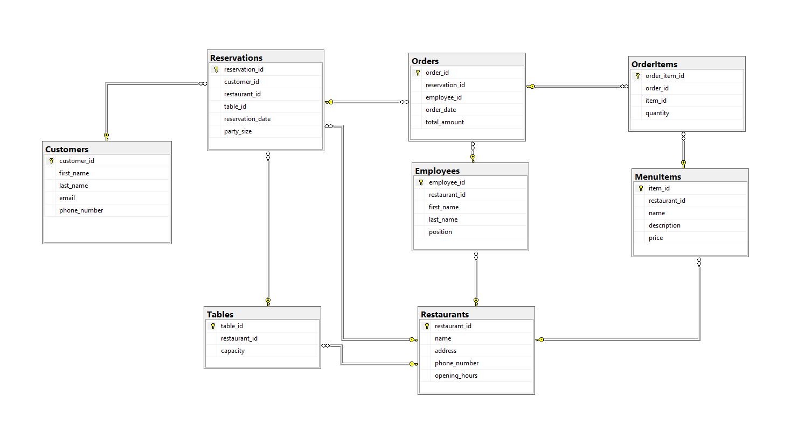

# Restaurant Reservation System

The **Restaurant Reservation System** is a comprehensive project designed to facilitate the efficient management of reservations, customers, orders, and employee information within a restaurant.

The project includes functionalities for creating, updating, and deleting customer records, managing reservations, handling orders, and overseeing employee information. Additionally, the system provides reporting and analytics features, enabling insights into customer interactions, revenue generation, and other vital aspects of restaurant operations.

## Database Schema 

